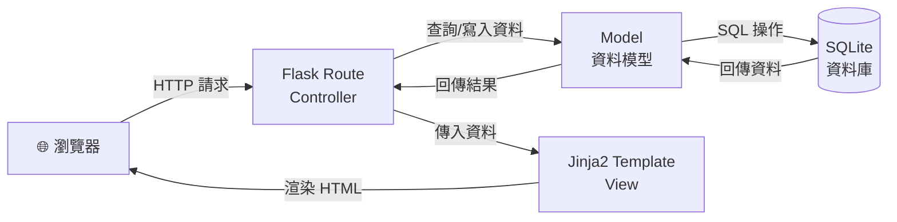
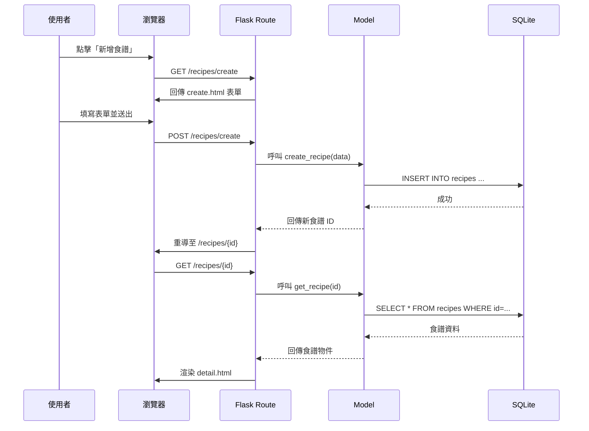
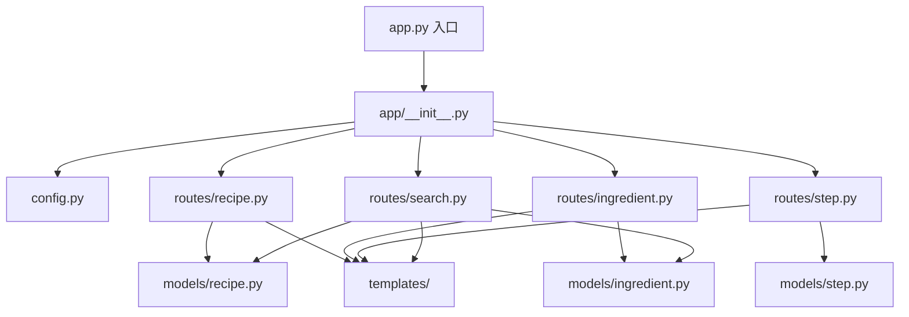

# 食譜收藏夾 — 系統架構文件

## 1. 技術架構說明

### 選用技術與原因

| 技術 | 用途 | 選用原因 |
|------|------|----------|
| **Python** | 後端程式語言 | 語法簡潔易學，社群資源豐富，適合快速開發 |
| **Flask** | 後端 Web 框架 | 輕量級框架，學習曲線低，適合中小型專案 |
| **Jinja2** | HTML 模板引擎 | Flask 內建支援，可在 HTML 中嵌入動態資料 |
| **SQLite** | 資料庫 | 免安裝、零設定，以單一檔案儲存，適合本機開發 |
| **HTML + CSS + JS** | 前端頁面 | 不依賴前端框架，降低學習成本與複雜度 |
| **Git + GitHub** | 版本控制 | 團隊協作與程式碼管理的業界標準 |

### Flask MVC 模式說明

本專案採用 **MVC（Model-View-Controller）** 架構模式，將程式碼依職責分離：

| 層級 | 對應位置 | 職責說明 |
|------|----------|----------|
| **Model（模型）** | `app/models/` | 定義資料表結構與資料庫操作邏輯（CRUD）。負責與 SQLite 資料庫互動，提供資料存取介面。 |
| **View（視圖）** | `app/templates/` | Jinja2 HTML 模板，負責將資料渲染成使用者看到的頁面。不包含商業邏輯。 |
| **Controller（控制器）** | `app/routes/` | Flask 路由函式，接收使用者的 HTTP 請求，呼叫 Model 取得資料，再傳給 View 渲染回應。 |

---

## 2. 專案資料夾結構

```
web_app_development2/
│
├── app.py                  ← 應用程式入口，建立 Flask app 並啟動伺服器
├── config.py               ← 設定檔（資料庫路徑、密鑰等）
├── requirements.txt        ← Python 套件依賴清單
│
├── app/                    ← 主要應用程式目錄
│   ├── __init__.py         ← 初始化 Flask app，註冊 Blueprint
│   │
│   ├── models/             ← Model 層：資料庫模型
│   │   ├── __init__.py
│   │   ├── recipe.py       ← 食譜模型（名稱、描述、分類、時間、份量）
│   │   ├── ingredient.py   ← 材料模型（名稱、數量、單位）
│   │   └── step.py         ← 步驟模型（步驟編號、內容）
│   │
│   ├── routes/             ← Controller 層：Flask 路由
│   │   ├── __init__.py
│   │   ├── recipe.py       ← 食譜相關路由（CRUD、列表、詳情）
│   │   ├── ingredient.py   ← 材料相關路由（新增、編輯、刪除）
│   │   ├── step.py         ← 步驟相關路由（新增、編輯、刪除、排序）
│   │   └── search.py       ← 搜尋路由（依名稱、材料搜尋）
│   │
│   ├── templates/          ← View 層：Jinja2 HTML 模板
│   │   ├── base.html       ← 基礎版型（共用 header、footer、導覽列）
│   │   ├── index.html      ← 首頁 / 食譜列表頁
│   │   ├── recipe/
│   │   │   ├── detail.html ← 食譜詳情頁（含材料與步驟）
│   │   │   ├── create.html ← 新增食譜表單
│   │   │   └── edit.html   ← 編輯食譜表單
│   │   └── search/
│   │       └── results.html← 搜尋結果頁
│   │
│   └── static/             ← 靜態資源
│       ├── css/
│       │   └── style.css   ← 全站樣式表
│       └── js/
│           └── main.js     ← 前端互動邏輯（確認刪除、步驟排序等）
│
├── instance/               ← 實例目錄（不納入版控）
│   └── database.db         ← SQLite 資料庫檔案
│
└── docs/                   ← 專案文件
    ├── PRD.md              ← 產品需求文件
    └── ARCHITECTURE.md     ← 系統架構文件（本文件）
```

### 各資料夾 / 檔案用途說明

| 路徑 | 說明 |
|------|------|
| `app.py` | 應用程式入口點，負責建立 Flask app 實例並啟動開發伺服器 |
| `config.py` | 集中管理設定值，如 `SECRET_KEY`、資料庫路徑等 |
| `requirements.txt` | 列出所需的 Python 套件（如 `Flask`），方便安裝 |
| `app/__init__.py` | 初始化 Flask app，設定資料庫連線，註冊所有 Blueprint |
| `app/models/` | 定義三個資料模型：食譜、材料、步驟，封裝所有資料庫操作 |
| `app/routes/` | 定義所有 URL 路由與對應的處理邏輯，使用 Blueprint 組織 |
| `app/templates/` | 所有 Jinja2 HTML 模板，使用模板繼承（`base.html`）確保一致性 |
| `app/static/` | CSS 樣式表與 JavaScript 檔案 |
| `instance/` | SQLite 資料庫檔案存放處，不納入 Git 版控 |
| `docs/` | 專案文件（PRD、架構設計等） |

---

## 3. 元件關係圖

### 系統整體架構



### 請求處理流程



### 模組依賴關係



---

## 4. 關鍵設計決策

### 決策一：使用 Blueprint 組織路由

**選擇：** 將路由依功能模組拆分為多個 Blueprint（recipe、ingredient、step、search）

**原因：**
- 避免所有路由擠在一個檔案中，提升可讀性
- 每個 Blueprint 負責單一功能領域，職責清楚
- 方便團隊分工，不同成員可同時開發不同模組

### 決策二：使用原生 sqlite3 而非 ORM

**選擇：** 使用 Python 內建的 `sqlite3` 模組操作資料庫

**原因：**
- 減少外部依賴，降低安裝與設定複雜度
- 學習直接操作 SQL 有助於理解資料庫基礎
- 對於本專案的規模，sqlite3 已足夠使用

### 決策三：使用 Jinja2 模板繼承

**選擇：** 建立 `base.html` 作為基礎版型，其他頁面繼承

**原因：**
- 統一全站的 header、footer、導覽列樣式
- 修改共用元素時只需改一處，避免重複程式碼
- Jinja2 原生支援 `` 與 `` 語法

### 決策四：材料與步驟獨立為子資源

**選擇：** 材料（Ingredient）與步驟（Step）各自獨立為 Model 與 Route，而非嵌入食譜中

**原因：**
- 食譜與材料、步驟為一對多關係，獨立管理更靈活
- 支援個別新增、編輯、刪除，不需每次都更新整道食譜
- 資料庫設計更正規化，避免資料冗餘

### 決策五：不做前後端分離

**選擇：** 由 Flask + Jinja2 直接渲染完整 HTML 頁面，不使用 API + 前端框架

**原因：**
- 降低技術複雜度，適合初學團隊
- 減少需要學習的技術（不需學 React/Vue）
- 對於表單操作為主的 CRUD 應用，傳統 Server-Side Rendering 已足夠

---

*文件建立日期：2026-04-23*
*最後更新日期：2026-04-23*
