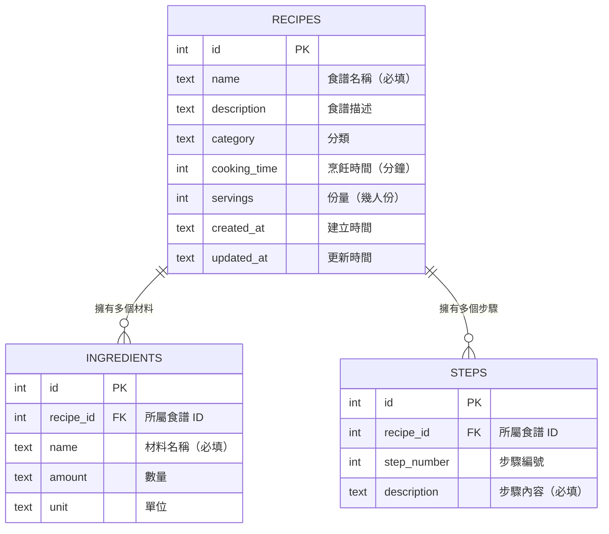

# 食譜收藏夾 — 資料庫設計文件

## 1. ER 圖（實體關係圖）

### 關聯說明

| 關聯 | 類型 | 說明 |
|------|------|------|
| RECIPES → INGREDIENTS | 一對多 | 一道食譜可以有多個材料 |
| RECIPES → STEPS | 一對多 | 一道食譜可以有多個步驟 |

---

## 2. 資料表詳細說明

### 2-1. RECIPES（食譜）

儲存食譜的基本資訊。

| 欄位 | 型別 | 必填 | 說明 |
|------|------|------|------|
| `id` | INTEGER | 自動產生 | 主鍵，自動遞增 |
| `name` | TEXT | ✅ 是 | 食譜名稱 |
| `description` | TEXT | 否 | 食譜描述 / 簡介 |
| `category` | TEXT | ✅ 是 | 食譜分類（中式、西式、日式、韓式、東南亞、甜點、飲品、其他） |
| `cooking_time` | INTEGER | 否 | 烹飪時間，單位為分鐘 |
| `servings` | INTEGER | 否 | 份量，幾人份 |
| `created_at` | TEXT | 自動產生 | 建立時間（ISO 8601 格式） |
| `updated_at` | TEXT | 自動產生 | 最後更新時間（ISO 8601 格式） |

- **Primary Key：** `id`
- **預設值：** `category` 預設為 `'其他'`，`created_at` 與 `updated_at` 預設為當前時間

### 2-2. INGREDIENTS（材料）

儲存每道食譜所需的材料清單。

| 欄位 | 型別 | 必填 | 說明 |
|------|------|------|------|
| `id` | INTEGER | 自動產生 | 主鍵，自動遞增 |
| `recipe_id` | INTEGER | ✅ 是 | 所屬食譜的 ID（外鍵） |
| `name` | TEXT | ✅ 是 | 材料名稱 |
| `amount` | TEXT | 否 | 數量（使用 TEXT 以支援「適量」「少許」等描述） |
| `unit` | TEXT | 否 | 單位（如：克、毫升、大匙、顆等） |

- **Primary Key：** `id`
- **Foreign Key：** `recipe_id` → `RECIPES(id)`，刪除食譜時連帶刪除材料（CASCADE）

### 2-3. STEPS（步驟）

儲存每道食譜的烹飪步驟，按順序排列。

| 欄位 | 型別 | 必填 | 說明 |
|------|------|------|------|
| `id` | INTEGER | 自動產生 | 主鍵，自動遞增 |
| `recipe_id` | INTEGER | ✅ 是 | 所屬食譜的 ID（外鍵） |
| `step_number` | INTEGER | ✅ 是 | 步驟編號（從 1 開始） |
| `description` | TEXT | ✅ 是 | 步驟內容描述 |

- **Primary Key：** `id`
- **Foreign Key：** `recipe_id` → `RECIPES(id)`，刪除食譜時連帶刪除步驟（CASCADE）

---

## 3. SQL 建表語法

完整的 SQL 建表語法請參考 [database/schema.sql](../database/schema.sql)。

---

## 4. Python Model 程式碼

每個 Model 放在 `app/models/` 資料夾，包含完整的 CRUD 方法：

| 檔案 | 對應資料表 | 提供方法 |
|------|-----------|---------|
| `app/models/recipe.py` | RECIPES | create, get_all, get_by_id, update, delete, search |
| `app/models/ingredient.py` | INGREDIENTS | create, get_by_recipe_id, get_by_id, update, delete |
| `app/models/step.py` | STEPS | create, get_by_recipe_id, get_by_id, update, delete, move_up, move_down |

所有 Model 使用 Python 內建 `sqlite3` 模組操作資料庫，搭配參數化查詢防止 SQL Injection。

---

*文件建立日期：2026-04-23*
*最後更新日期：2026-04-23*
