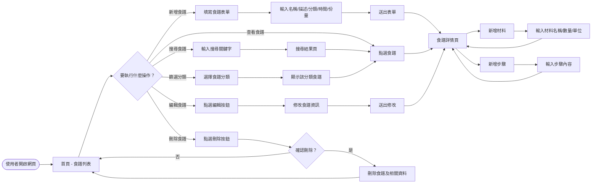
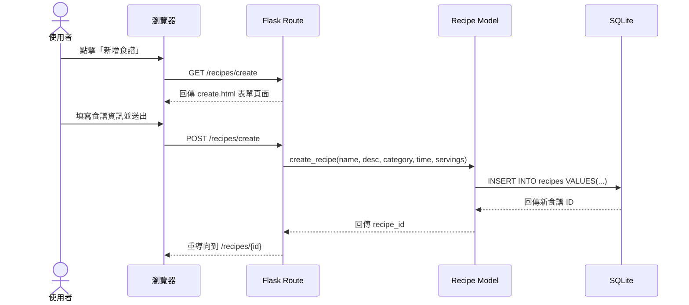
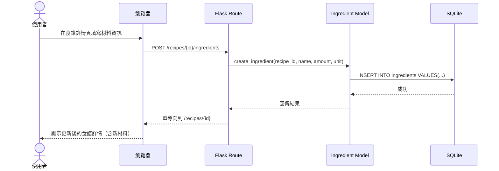
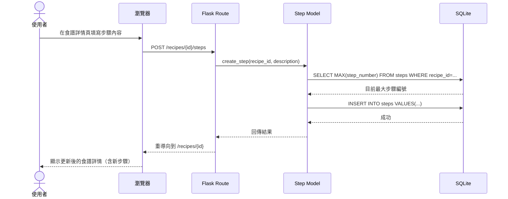
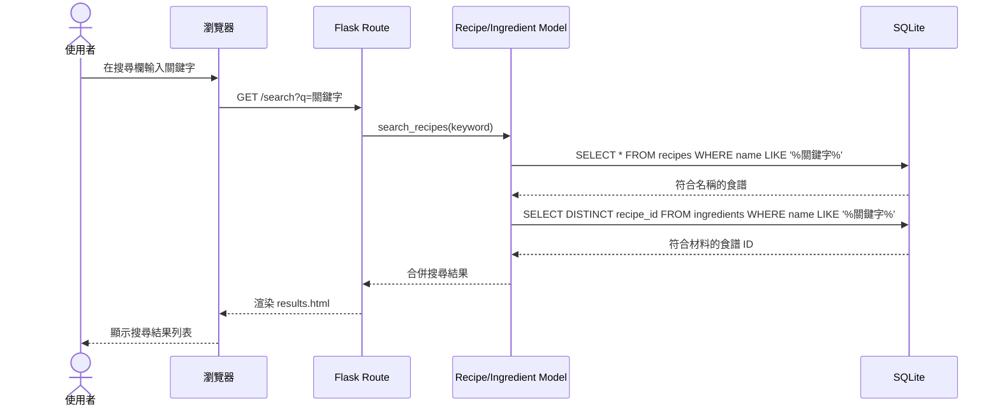
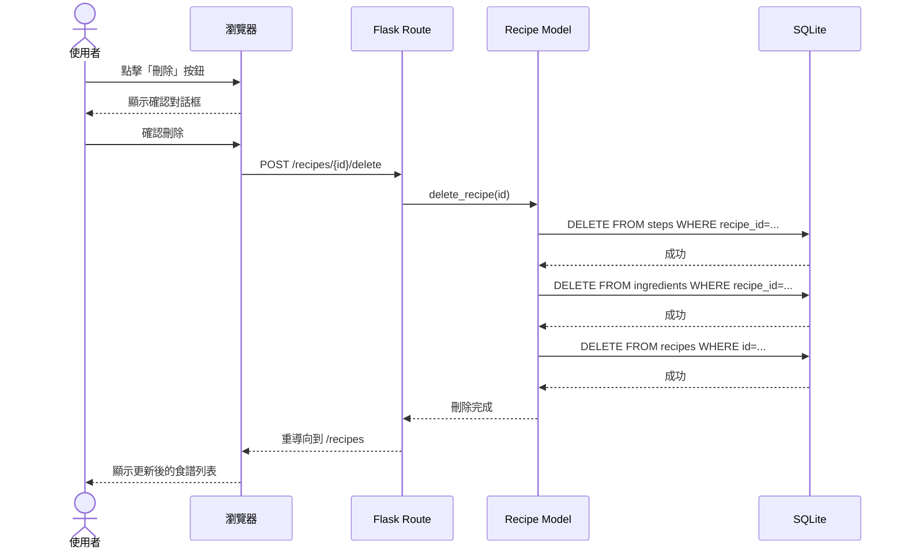

# 食譜收藏夾 — 流程圖文件

## 1. 使用者流程圖（User Flow）

以下流程圖展示使用者從進入網站開始，可以執行的所有主要操作路徑。

### 流程說明

1. **進入首頁**：使用者開啟網站後，看到所有食譜的列表
2. **新增食譜**：填寫表單建立食譜 → 進入詳情頁 → 可繼續新增材料與步驟
3. **查看食譜**：從列表點選任一食譜，進入詳情頁查看完整資訊
4. **編輯食譜**：在詳情頁點選編輯，修改後儲存回到詳情頁
5. **刪除食譜**：點選刪除按鈕，確認後刪除並返回列表
6. **搜尋食譜**：輸入關鍵字搜尋，從搜尋結果進入食譜詳情
7. **篩選分類**：選擇分類篩選食譜列表

---

## 2. 系統序列圖（Sequence Diagram）

### 2-1. 新增食譜流程

### 2-2. 新增材料流程

### 2-3. 新增步驟流程

### 2-4. 搜尋食譜流程

### 2-5. 刪除食譜流程

---

## 3. 功能清單對照表

| 功能 | URL 路徑 | HTTP 方法 | 說明 |
|------|----------|-----------|------|
| 首頁 / 食譜列表 | `/` 或 `/recipes` | GET | 顯示所有食譜列表，支援分類篩選 |
| 新增食譜表單 | `/recipes/create` | GET | 顯示新增食譜的表單頁面 |
| 新增食譜 | `/recipes/create` | POST | 接收表單資料，建立新食譜 |
| 食譜詳情 | `/recipes/<id>` | GET | 顯示食譜完整資訊（含材料與步驟） |
| 編輯食譜表單 | `/recipes/<id>/edit` | GET | 顯示編輯食譜的表單頁面 |
| 更新食譜 | `/recipes/<id>/edit` | POST | 接收修改資料，更新食譜 |
| 刪除食譜 | `/recipes/<id>/delete` | POST | 刪除食譜及其所有材料與步驟 |
| 新增材料 | `/recipes/<id>/ingredients` | POST | 為食譜新增一項材料 |
| 編輯材料 | `/recipes/<id>/ingredients/<ing_id>/edit` | POST | 更新材料資訊 |
| 刪除材料 | `/recipes/<id>/ingredients/<ing_id>/delete` | POST | 刪除一項材料 |
| 新增步驟 | `/recipes/<id>/steps` | POST | 為食譜新增一個步驟 |
| 編輯步驟 | `/recipes/<id>/steps/<step_id>/edit` | POST | 更新步驟內容 |
| 刪除步驟 | `/recipes/<id>/steps/<step_id>/delete` | POST | 刪除一個步驟並重新編號 |
| 步驟上移 | `/recipes/<id>/steps/<step_id>/move-up` | POST | 將步驟順序上移一位 |
| 步驟下移 | `/recipes/<id>/steps/<step_id>/move-down` | POST | 將步驟順序下移一位 |
| 搜尋食譜 | `/search` | GET | 依關鍵字搜尋食譜名稱與材料 |

---

*文件建立日期：2026-04-23*
*最後更新日期：2026-04-23*
